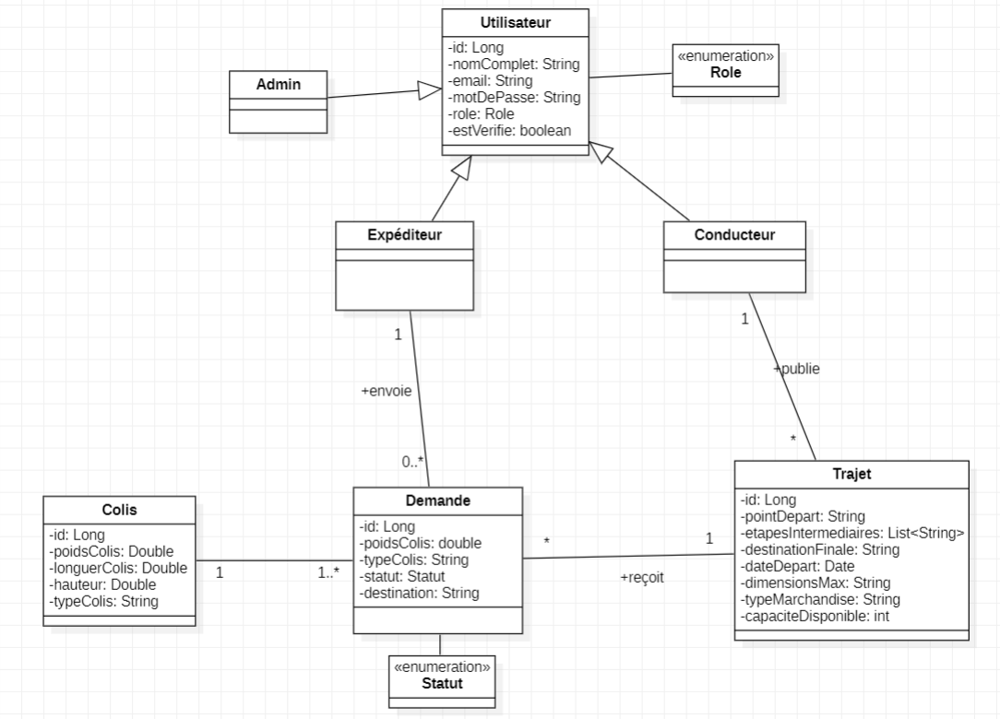
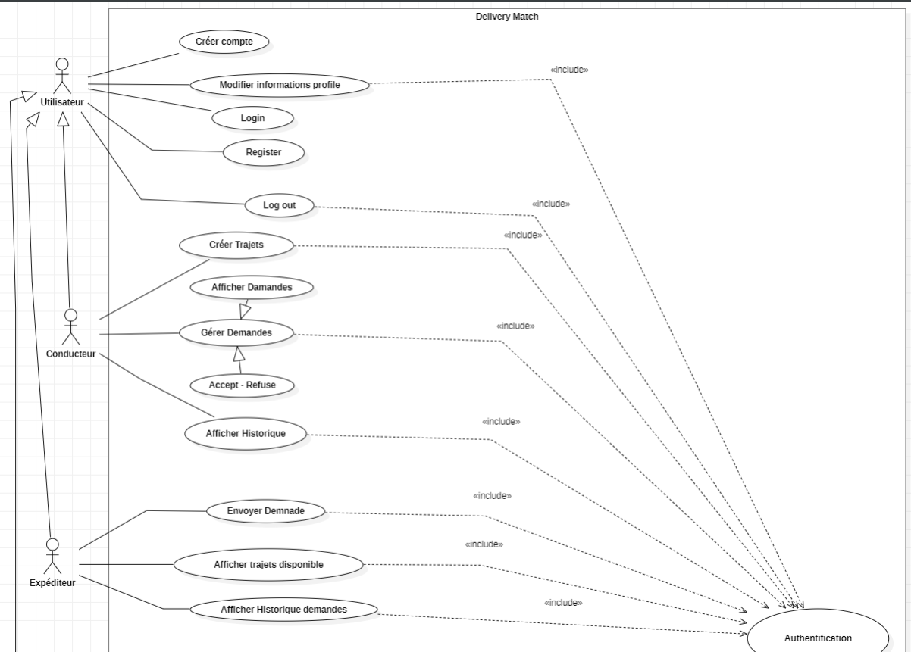
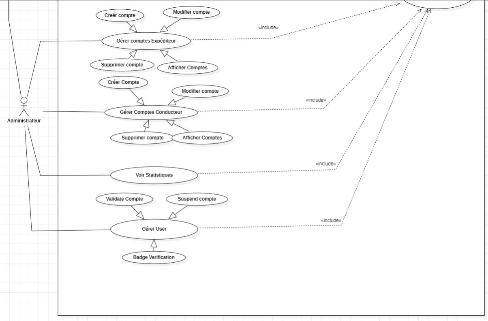
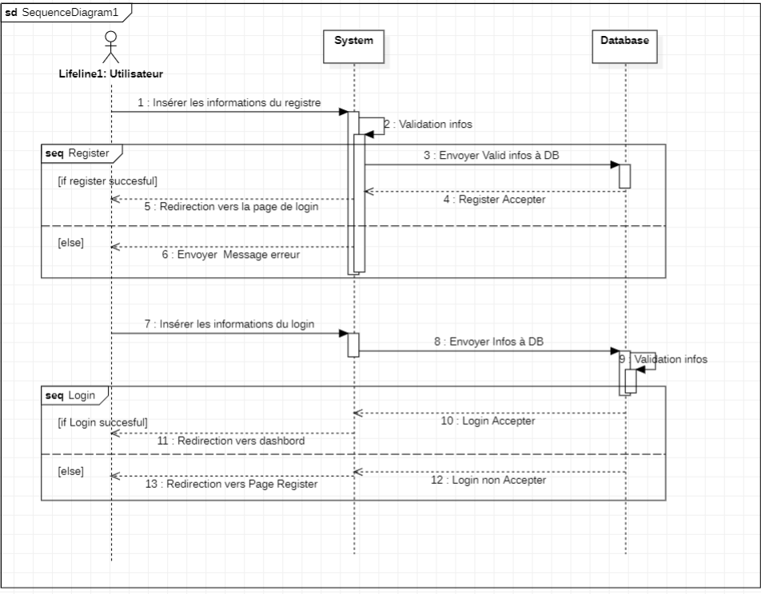

# 🚚 DeliveryMatch

**DeliveryMatch** is a full-stack web application that connects drivers with parcel shippers using a collaborative co-transport approach. The platform optimizes routes, reduces transport costs, and contributes to limiting the environmental impact of parcel deliveries.

---

## 📌 Table of Contents

- [✨ Features](#-features)
- [👥 User Roles & Stories](#-user-roles--stories)
- [🛠️ Technologies Used](#-technologies-used)
- [📊 Admin Dashboard](#-admin-dashboard)
- [📦 Setup & Installation](#-setup--installation)

---

## ✨ Features

- Account registration and secure authentication
- Role-based access for **Users**, **Drivers**, **Senders**, and **Admins**
- Trip announcements and transport request management
- Profile management and trip/package history
- Notification system for important actions
- Rating and review system after deliveries
- Admin dashboard with real-time analytics and moderation tools

---

## 👥 User Roles & Stories

### 🧑 User
- Register with first name, last name, email, and password
- Secure login/logout
- Edit personal information
- Receive notifications for key actions

### 🚛 DriverService
- Publish trip announcements (departure, stops, destination, capacity, goods type)
- Manage transport requests (accept/reject)
- View trip and delivery history
- Rate shippers after deliveries

### 📦 Sender
- Browse trip listings with filters (destination, date, type)
- Send transport requests with package details (dimensions, weight, type)
- View history of requests and deliveries
- Rate drivers after deliveries

### 🛡️ Administrator
- Access management dashboard (users, requests, trips)
- Validate, suspend, or verify users
- Edit/delete driver announcements
- View analytics using Chart.js (ads count, acceptance rate, active users, etc.)

---

## 🛠️ Technologies Used

| Layer           | Technology                              |
|----------------|------------------------------------------|
| Frontend       | Angular 16+, Tailwind, Material |
| Backend        | Spring Boot, Spring Security, Spring Data JPA |
| Database       | MySQL                       |
| Charts         | Chart.js / Angular-chart.js              |
| API Docs       | Swagger / Postman Collection             |
| Containerization| Docker                                  |
| Testing        | JUnit                                    |

---

## 📊 Admin Dashboard

- 📈 Number of published ads
- ✅ Acceptance rate of requests
- 👥 Active user tracking
- Management of users, announcements, and requests

Charts powered by **Chart.js**

---

## 📦 Setup & Installation

### Prerequisites
- Node.js & Angular CLI
- Java 17+
- Docker & Docker Compose
- Maven

---
## UMLs
### Class Diagram

### Class Diagram

### Sequence Diagram

### ===>  [Postman LINK ](https://yguhijopl.postman.co/workspace/My-Workspace~49aab289-6de5-487b-8f91-58ce1aacf8db/collection/41299916-1f8ddd1d-8ed1-4a6e-b15a-3511b6380555?action=share&creator=41299916)